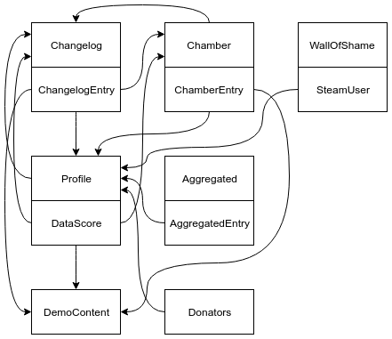

[](https://travis-ci.org/NeKzor/Portal2Boards.Net)
[](https://github.com/NeKzor/Portal2Boards.Net/projects/3)
[](https://github.com/NeKzor/Portal2Boards.Net/releases)
[](https://www.nuget.org/packages/Portal2Boards.Net)

Retrieve Portal 2 challenge mode data from the speedrunning community [board.iverb.me](https://board.iverb.me).
Client includes automatic caching system and exception event for logging purposes.

## Examples

- [nekzor.github.io/stats](https://nekzor.github.io/stats)
- [nekzor.github.io/history](https://nekzor.github.io/history)
- [nekzor.github.io/skill](https://nekzor.github.io/skill)
- [nekzor.github.io/seum](https://nekzor.github.io/seum)
- [NeKzBot](https://github.com/NeKzor/NeKzBot)

## Credits
- [Portal2Boards](https://github.com/iVerb1/Portal2Boards)
- [Newtonsoft.Json](https://github.com/JamesNK/Newtonsoft.Json)

## Documentation
  - [Namespaces](#namespaces)
  - [Client](#client)
    - [Usage](#usage)
    - [Caching](#caching)
    - [Logging](#logging)
  - [Changelog](#changelog)
    - [Query](#query)
    - [Advanced](#advanced)
  - [Chamber](#chamber)
  - [Profile](#profile)
  - [Aggregated](#aggregated)
  - [Demo Content](#demo-content)
  - [Wall of Shame](#wall-of-shame)
  - [Donators](#donators)
  - [Relations](#relations)
  - [Extensions](#extensions)

### Namespaces

| Namespace | Description |
| --- | --- |
| Portal2Boards | Client for fetching changelog, chamber, profile, aggregated data, demo content, wall of shame and donators. |
| Portal2Boards.API.Models | API models converted from raw json. |
| Portal2Boards.Extensions | Useful extension methods. |

### Client

#### Usage
```cs
using Portal2Boards;

using (var client = new Portal2BoardsClient("MyApplication/1.0"))
{
    // Do stuff
}
```

#### Caching
```cs
// Everything will be handled automatically
// This is default
_client.AutoCache = true;

// Reset to default time (5 minutes)
_client.CacheResetTime = 0;

// Stop caching
_client.AutoCache = false;

// Reset timer manually
await _client.ResetCacheTimer();

// Clear cache manually
await _client.ClearCache();
```

#### Logging
```cs
// Logs client-side exceptions
_client.Log += LogPortal2Boards;

Task LogPortal2Boards(object sender, LogMessage msg)
{
    // Log stuff
}
```

### Changelog

#### Query
```cs
// Default
var changelog = await _client.GetChangelogAsync();

// Get all wrs within 24h
changelog = await _client.GetChangelogAsync("?maxDaysAgo=1&wr=1");
```

#### Advanced

```cs
var changelog = await _client.GetChangelogAsync(q =>
{
  // Names will be escaped automatically
  q.ProfileName = "Portal Rex";
  q.WorldRecord = true;
});

// With builder
changelog = await _client.GetChangelogAsync(() =>
  new ChangelogQueryBuilder()
    .WithWorldRecord(true)
    .WithDemo(true)
    .Build()
);
```

### Chamber
```cs
// By map id (ulong)
var chamber = await _client.GetChamberAsync(id);

// With extensions
using Portal2Boards.Net.Extensions;
var map = await Portal2Map.Search("Smooth Jazz");
chamber = await _client.GetChamberAsync(map);
```

### Profile
```cs
// By name (spaces will be removed automatically)
var profile = await _client.GetProfileAsync("Portal Rex");

// By steam id (ulong)
profile = await _client.GetProfileAsync(id);
```

### Aggregated
```cs
// Overall
var aggregated = await _client.GetAggregatedAsync();

// Mode
aggregated = await _client.GetAggregatedAsync(AggregatedMode.SinglePlayer);

// Chapter
aggregated = await _client.GetAggregatedAsync(ChapterType.ThePartWhereHeKillsYou);
```

### Demo Content
```cs
// Use changelog id (ulong)
var bytes = await _client.GetDemoContentAsync(id);
```

### Wall of Shame
```cs
var wos = await _client.GetWallOfShameAsync();

foreach (SteamUser user in wos)
{
  Console.WriteLine($"{user.Name}");
}
```

### Donators
```cs
var donators = await _client.GetAggregatedAsync();

foreach (Donator donator in donators)
{
  Console.Write($"{donator.Player.Name}: ");
  Console.WriteLine($"€{donator.DonationAmount:N2}");
}
```

### Relations

[](p2bn_relations.png)

Entity interfaces can be casted to its actual type which exposes methods for fetching another entity or updating itself.

```cs
Profile pro = await _client.GetProfileAsync(id);
Changelog clog = await pro.GetChangelogAsync();
```

`Changelog`, `Chamber`, `Profile` and `Aggregated` implement the `IUpdatable` interface for easy access to the root client.

```cs
Profile pro = await _client.GetProfileAsync(id);
await pro.UpdateAsync(true); // true forces cache update
```

Note: `WallOfShame` and `Demo` do not have its own entity type.

### Extensions

```cs
_ = Portal2Map.Search("Portal Gun");

// Converts to 3.9f
Console.WriteLine(390u.AsTime());

// Prints "1:00.00"
Console.WriteLine(6000u.AsTimeToString());

// Prints in "yyyy-MM-dd HH:mm:ss" format
Console.WriteLine(DateTime.Now.DateTimeToString());
```
